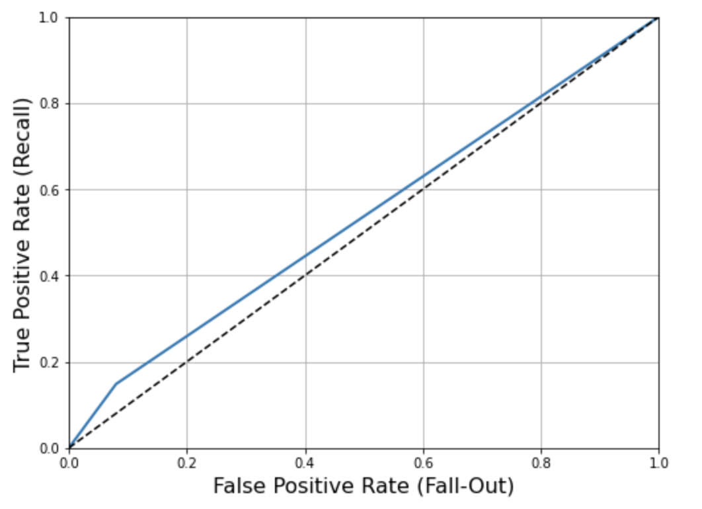

# CMPE-assignment

## Kmeans- 

**Kmeans from scratch**

**Dataset - Yelp Restaurants**

About - From the Business Objects, I tried to find food related areas in Portland city. These are characterized by closeness and similarity of restaurants. Used the "longitude" and "latitude" to cluster closeness. Used "categories" to cluster for similarity.

**Comments**

I used complete link method for heirarchical clustering i.e finding the distance between the two points farthest from each other in order to combine clusters during the agglomerative clustering method.

Performed GMM using co-variance as 'spherical' so that each component has its own single variance.

I calculated the ratio of each category present in the cluster with the total number of restaurants in Portland city of that category. And then selected the category having a maximum ratio as the label for that particular cluster. Thus, avoiding dominance by a particular category having large number of restaurants. Below is the interpretation of the results of the methods used.

**K-means:** K-means has more well-defined clusters because it does hard-clustering i.e. each point belongs to one and only one cluster. also, since the function used is kmeans, the initial points are calculated based on a probability function.

Hierarchical: Since it considers each point as a cluster on its own and then combines the points on the basis of distance between the points. It gives a result which varies quite a lot from the K-means method since it does not use any random points.

Gaussian Mixture Model: GMM uses soft-clustering and hence has overlapping clusters.It calculates the probability of a point belonging to each cluster and hence is more likely to give better clustering. It gives clustering similar to K-means but with some overlapping points.

DBSCAN: DBSCAN fits the model on the training dataset and predicts a cluster for each example in the dataset. A scatter plot is then created with points colored by their assigned cluster.

## Gradient Boost Methods:

The Gradient Boosting Machine is a powerful ensemble machine learning algorithm that uses decision trees.

Boosting is a general ensemble technique that involves sequentially adding models to the ensemble where subsequent models correct the performance of prior models. AdaBoost was the first algorithm to deliver on the promise of boosting.

Gradient boosting is a generalization of AdaBoosting, improving the performance of the approach and introducing ideas from bootstrap aggregation to further improve the models, such as randomly sampling the samples and features when fitting ensemble members.

Gradient boosting performs well, if not the best, on a wide range of tabular datasets, and versions of the algorithm like XGBoost and LightBoost often play an important role in winning machine learning competitions.

Demonstrated Gradient Boost Methods With Proper Results And Visualizations

**Showcase GBM Classifier Techniques**

RandomForest Classifier
Decision Tree Classifier
AdaBoost Classifier
XGBoost Classifier
LightGBM Classifier
Catboost Classifier

**Showcase GBM Regression Techniques**

XGBoostRegressor
CatboostRegressor
LightGBMRegressor
**Showcase GBM Ranking Techniques**

XGBoost Ranking
Catboost Ranking
LightGBM Ranking**

## Apriori Algorithm from scratch in Python

The Apriori algorithm uses frequent itemsets to generate association rules, and it is designed to work on the databases that contain transactions. With the help of these association rule, it determines how strongly or how weakly two objects are connected. This algorithm uses a breadth-first search and Hash Tree to calculate the itemset associations efficiently. It is the iterative process for finding the frequent itemsets from the large dataset.

## Decision Tree from Scratch in Python

A decision tree is a flowchart-like structure in which each internal node represents a "test" on an attribute (e.g. whether a coin flip comes up heads or tails), each branch represents the outcome of the test, and each leaf node represents a class label (decision taken after computing all attributes).

## Random Forest from Scratch in Python

Random forests or random decision forests are an ensemble learning method for classification, regression and other tasks that operates by constructing a multitude of decision trees at training time

## Random Foreset vs Decision Tree

A decision tree combines some decisions, whereas a random forest combines several decision trees. Thus, it is a long process, yet slow. Whereas, a decision tree is fast and operates easily on large data sets, especially the linear one. The random forest model needs rigorous training.

## AdaBoost algorithm from scratch

AdaBoost algorithm, short for Adaptive Boosting, is a Boosting technique used as an Ensemble Method in Machine Learning. It is called Adaptive Boosting as the weights are re-assigned to each instance, with higher weights assigned to incorrectly classified instances. Boosting is used to reduce bias as well as variance for supervised learning. It works on the principle of learners growing sequentially. Except for the first, each subsequent learner is grown from previously grown learners. In simple words, weak learners are converted into strong ones. The AdaBoost algorithm works on the same principle as boosting with a slight difference.

## Shortcomings Of Apriori Algorithm

Using Apriori needs a generation of candidate itemsets. These itemsets may be large in number if the itemset in the database is huge.
Apriori needs multiple scans of the database to check the support of each itemset generated and this leads to high costs.
These shortcomings can be overcome using the FP growth algorithm.

## Frequent Pattern Growth Algorithm from Scratch

This algorithm is an improvement to the Apriori method. A frequent pattern is generated without the need for candidate generation. FP growth algorithm represents the database in the form of a tree called a frequent pattern tree or FP tree.

This tree structure will maintain the association between the itemsets. The database is fragmented using one frequent item. This fragmented part is called “pattern fragment”. The itemsets of these fragmented patterns are analyzed. Thus with this method, the search for frequent itemsets is reduced comparatively.
